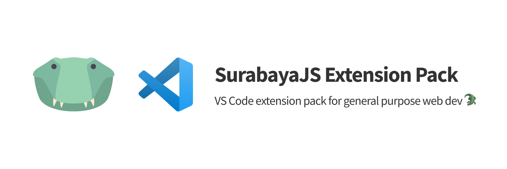

<div align="center">

[][self]
[][self]
[][self]
[][license]

[](./settings.json)
[](./settings.json)
[](./settings.json)

</div>

---

## Requirements

Make sure these packages are globally installed so that the extensions can work as intended:

```bash
# using npm
npm -g i eslint prettier typescript

# using yarn
yarn global add eslint prettier typescript
```

## Copyright

[MIT License Copyright (c) 2020 SurabayaJS](./LICENSE)

[self]: https://marketplace.visualstudio.com/items?itemName=surabayajs.surabayajs-extension-pack
[license]: https://marketplace.visualstudio.com/items/surabayajs.surabayajs-extension-pack
